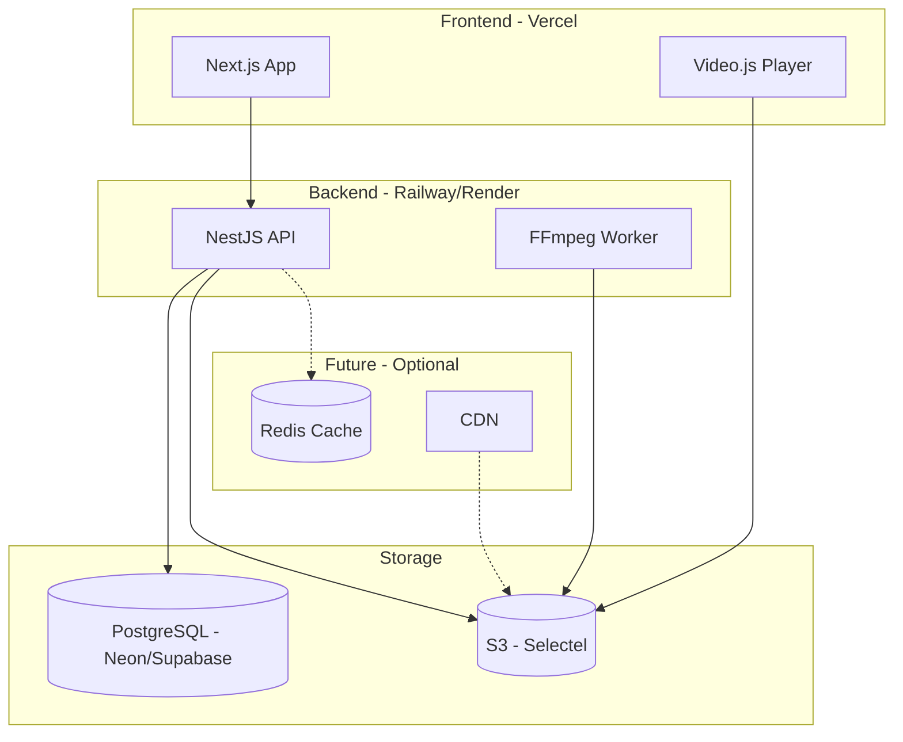
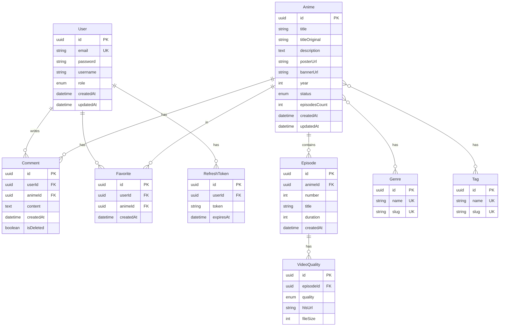
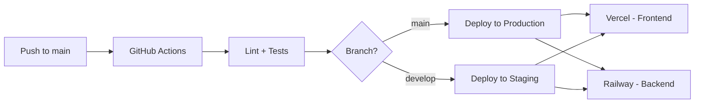

# План разработки стримингового аниме-сайта

## 1. Обзор архитектуры



---

## 2. Структура базы данных (Prisma Schema)



---

## 3. Технологический стек

### Frontend

| Категория | Технология | Назначение |

|-----------|------------|------------|

| Framework | Next.js 14+ (App Router) | SSR, роутинг, оптимизация |

| Language | TypeScript | Типизация |

| Styling | TailwindCSS | Утилитарные стили |

| Forms | React Hook Form + Zod | Валидация форм |

| HTTP | Axios | API запросы |

| Video | Video.js + videojs-hls-quality-selector | HLS плеер |

| State | Context API (auth) + React Query | Управление состоянием |

| Architecture | FSD (Feature-Sliced Design) | Структура проекта |

### Backend

| Категория | Технология | Назначение |

|-----------|------------|------------|

| Framework | NestJS | API сервер |

| Language | TypeScript | Типизация |

| ORM | Prisma | Работа с БД |

| Database | PostgreSQL (Neon/Supabase) | Хранение данных |

| Storage | S3 (Selectel) | Видео и изображения |

| Auth | JWT (access + refresh tokens) | Авторизация |

| Docs | Swagger/OpenAPI | Документация API |

| Video | FFmpeg (fluent-ffmpeg) | Конвертация в HLS |

---

## 4. Структура проекта

### Backend (NestJS - Domain-Driven)

```
backend/
├── prisma/
│   ├── schema.prisma
│   └── migrations/
├── src/
│   ├── common/
│   │   ├── decorators/        # @Roles, @CurrentUser
│   │   ├── guards/            # JwtAuthGuard, RolesGuard
│   │   ├── interceptors/      # TransformInterceptor
│   │   ├── filters/           # HttpExceptionFilter
│   │   └── pipes/             # ValidationPipe
│   ├── config/
│   │   ├── database.config.ts
│   │   ├── jwt.config.ts
│   │   ├── s3.config.ts
│   │   └── redis.config.ts    # Заготовка для Redis
│   ├── modules/
│   │   ├── auth/
│   │   │   ├── dto/
│   │   │   ├── strategies/    # JwtStrategy, GoogleStrategy
│   │   │   ├── auth.controller.ts
│   │   │   ├── auth.service.ts
│   │   │   └── auth.module.ts
│   │   ├── user/
│   │   ├── anime/
│   │   │   ├── dto/
│   │   │   ├── anime.controller.ts
│   │   │   ├── anime.service.ts
│   │   │   └── anime.module.ts
│   │   ├── episode/
│   │   ├── comment/
│   │   ├── favorite/
│   │   ├── genre/
│   │   ├── upload/            # Загрузка файлов в S3
│   │   └── video-processor/   # FFmpeg воркер
│   ├── prisma/
│   │   ├── prisma.service.ts
│   │   └── prisma.module.ts
│   ├── app.module.ts
│   └── main.ts
├── workers/
│   └── video-converter/       # Отдельный процесс для FFmpeg
│       ├── converter.ts
│       └── queue.ts
└── scripts/
    └── local-converter.ts     # Скрипт для конвертации на ПК
```

### Frontend (Next.js - FSD Architecture)

```
frontend/
├── src/
│   ├── app/                   # Next.js App Router
│   │   ├── (auth)/
│   │   │   ├── login/
│   │   │   └── register/
│   │   ├── (main)/
│   │   │   ├── page.tsx       # Главная
│   │   │   ├── catalog/
│   │   │   ├── anime/[id]/
│   │   │   └── favorites/
│   │   ├── (admin)/
│   │   │   ├── dashboard/
│   │   │   ├── anime/
│   │   │   ├── episodes/
│   │   │   └── users/
│   │   ├── layout.tsx
│   │   └── providers.tsx
│   ├── entities/              # FSD: Бизнес-сущности
│   │   ├── anime/
│   │   ├── episode/
│   │   ├── user/
│   │   └── comment/
│   ├── features/              # FSD: Пользовательские сценарии
│   │   ├── auth/
│   │   ├── video-player/
│   │   ├── anime-filter/
│   │   ├── comments/
│   │   └── favorites/
│   ├── widgets/               # FSD: Композиционные блоки
│   │   ├── header/
│   │   ├── footer/
│   │   ├── anime-card/
│   │   ├── anime-grid/
│   │   ├── episode-list/
│   │   └── admin-sidebar/
│   ├── shared/                # FSD: Переиспользуемое
│   │   ├── api/
│   │   │   ├── axios.ts
│   │   │   └── endpoints/
│   │   ├── config/
│   │   ├── lib/
│   │   ├── ui/                # UI Kit
│   │   │   ├── Button/
│   │   │   ├── Input/
│   │   │   ├── Modal/
│   │   │   └── ...
│   │   └── types/
│   └── processes/             # FSD: Бизнес-процессы (опционально)
├── public/
└── tailwind.config.ts
```

---

## 5. API Endpoints

### Auth

| Method | Endpoint | Описание | Роль |

|--------|----------|----------|------|

| POST | `/auth/register` | Регистрация | Public |

| POST | `/auth/login` | Вход | Public |

| POST | `/auth/refresh` | Обновление токенов | Public |

| POST | `/auth/logout` | Выход | User |

| GET | `/auth/google` | OAuth Google | Public |

| GET | `/auth/google/callback` | Callback Google | Public |

| GET | `/auth/me` | Текущий пользователь | User |

### Anime

| Method | Endpoint | Описание | Роль |

|--------|----------|----------|------|

| GET | `/anime` | Список с фильтрами | Public |

| GET | `/anime/:id` | Детали аниме | Public |

| POST | `/anime` | Создание | Moderator+ |

| PATCH | `/anime/:id` | Обновление | Moderator+ |

| DELETE | `/anime/:id` | Удаление | Admin |

### Episodes

| Method | Endpoint | Описание | Роль |

|--------|----------|----------|------|

| GET | `/anime/:animeId/episodes` | Список эпизодов | Public |

| GET | `/episodes/:id` | Детали эпизода | Public |

| POST | `/anime/:animeId/episodes` | Создание эпизода | Moderator+ |

| PATCH | `/episodes/:id` | Обновление | Moderator+ |

| DELETE | `/episodes/:id` | Удаление | Admin |

### Video Quality

| Method | Endpoint | Описание | Роль |

|--------|----------|----------|------|

| GET | `/episodes/:id/qualities` | Доступные качества | Public |

| GET | `/episodes/:id/stream/:quality` | HLS manifest URL | Public |

### Comments

| Method | Endpoint | Описание | Роль |

|--------|----------|----------|------|

| GET | `/anime/:animeId/comments` | Комментарии | Public |

| POST | `/anime/:animeId/comments` | Добавить комментарий | User |

| DELETE | `/comments/:id` | Удалить комментарий | Owner/Moderator+ |

### Favorites

| Method | Endpoint | Описание | Роль |

|--------|----------|----------|------|

| GET | `/favorites` | Список избранного | User |

| POST | `/favorites/:animeId` | Добавить в избранное | User |

| DELETE | `/favorites/:animeId` | Удалить из избранного | User |

### Upload (Admin Panel)

| Method | Endpoint | Описание | Роль |

|--------|----------|----------|------|

| POST | `/upload/poster` | Загрузка постера | Moderator+ |

| POST | `/upload/video` | Загрузка видео | Moderator+ |

| GET | `/upload/status/:jobId` | Статус конвертации | Moderator+ |

### Genres/Tags

| Method | Endpoint | Описание | Роль |

|--------|----------|----------|------|

| GET | `/genres` | Список жанров | Public |

| GET | `/tags` | Список тегов | Public |

---

## 6. HLS Video Streaming

### Структура в S3

```
s3://bucket/
├── anime/
│   └── {animeId}/
│       ├── poster.webp
│       ├── banner.webp
│       └── episodes/
│           └── {episodeId}/
│               ├── 360p/
│               │   ├── playlist.m3u8
│               │   └── segment_*.ts
│               ├── 480p/
│               │   ├── playlist.m3u8
│               │   └── segment_*.ts
│               ├── 720p/
│               │   ├── playlist.m3u8
│               │   └── segment_*.ts
│               └── master.m3u8
```

### Локальный скрипт конвертации (для твоего ПК)

```bash
# Установить FFmpeg на ПК
# Скрипт будет в scripts/local-converter.ts

# Использование:
npm run convert -- --input ./video.mp4 --output ./output --anime-id xxx --episode-id yyy
```

Скрипт будет:

1. Конвертировать в 3 качества (360p, 480p, 720p)
2. Создавать HLS сегменты по 10 секунд
3. Генерировать master.m3u8 с adaptive bitrate
4. Загружать в S3

### Воркер для сервера (опционально)

- Очередь задач на Bull (в будущем с Redis)
- Пока можно использовать in-memory очередь
- Обработка загруженных через админку видео

---

## 7. Авторизация и роли

### JWT Стратегия

- **Access Token**: 15 минут, хранится в памяти
- **Refresh Token**: 7 дней, httpOnly cookie
- При истечении access token - автоматический refresh

### Роли и права

| Действие | USER | MODERATOR | ADMIN |

|----------|------|-----------|-------|

| Просмотр контента | Да | Да | Да |

| Комментарии | Да | Да | Да |

| Избранное | Да | Да | Да |

| Управление аниме | - | Да | Да |

| Управление эпизодами | - | Да | Да |

| Удаление комментариев | Свои | Все | Все |

| Управление жанрами/тегами | - | Да | Да |

| Управление пользователями | - | - | Да |

| Назначение ролей | - | - | Да |

---

## 8. Адаптивный дизайн

### Breakpoints (TailwindCSS)

```typescript
// tailwind.config.ts
screens: {
  'xs': '375px',    // Мобильные (iPhone SE)
  'sm': '640px',    // Большие телефоны
  'md': '768px',    // Планшеты
  'lg': '1024px',   // Ноутбуки
  'xl': '1280px',   // Десктопы
  '2xl': '1536px',  // Широкие мониторы
}
```

### Сетка каталога

- **Mobile (xs-sm)**: 2 карточки в ряд
- **Tablet (md)**: 3 карточки в ряд
- **Laptop (lg)**: 4 карточки в ряд
- **Desktop (xl+)**: 5-6 карточек в ряд

---

## 9. Инфраструктура и деплой

### Окружения

```
development -> staging -> production
```

### Переменные окружения (Backend)

```env
# Database
DATABASE_URL=postgresql://...

# JWT
JWT_ACCESS_SECRET=xxx
JWT_REFRESH_SECRET=xxx
JWT_ACCESS_EXPIRES=15m
JWT_REFRESH_EXPIRES=7d

# S3 (Selectel)
S3_ENDPOINT=https://s3.storage.selcloud.ru
S3_ACCESS_KEY=xxx
S3_SECRET_KEY=xxx
S3_BUCKET=anime-streaming

# Google OAuth
GOOGLE_CLIENT_ID=xxx
GOOGLE_CLIENT_SECRET=xxx
GOOGLE_CALLBACK_URL=https://api.domain.com/auth/google/callback

# Redis (подготовка)
REDIS_URL=redis://...

# Frontend URL (CORS)
FRONTEND_URL=https://domain.com
```

### CI/CD Pipeline



---

## 10. План реализации по этапам

### Этап 1: Базовая инфраструктура (1-2 недели)

- Настройка монорепо (pnpm workspaces или отдельные репозитории)
- Инициализация Next.js проекта с FSD структурой
- Инициализация NestJS проекта
- Настройка Prisma и базовая схема
- Настройка S3 клиента
- Базовая авторизация (email + password)
- Swagger документация

### Этап 2: Ядро функционала (2-3 недели)

- CRUD для аниме, эпизодов, жанров
- Загрузка постеров в S3
- Скрипт локальной конвертации видео в HLS
- Интеграция Video.js с HLS
- Выбор качества видео в плеере
- Каталог с базовой фильтрацией

### Этап 3: Пользовательские функции (1-2 недели)

- Система комментариев
- Избранное
- Google OAuth
- Профиль пользователя

### Этап 4: Админ-панель (1-2 недели)

- Dashboard с статистикой
- Управление аниме и эпизодами
- Управление пользователями (для Admin)
- Загрузка видео через интерфейс
- Модерация комментариев

### Этап 5: Оптимизация и деплой (1 неделя)

- Адаптивная верстка
- SEO оптимизация (meta, sitemap)
- Деплой на Vercel + Railway
- Настройка домена
- Мониторинг и логирование

### Этап 6: Будущие улучшения (по мере необходимости)

- Интеграция Redis для кэширования
- CDN для видео контента
- Система уведомлений
- Расширенная аналитика
- Места для рекламы

---

## 11. Рекомендации по технологиям

### Что добавить к твоему списку:

1. **@tanstack/react-query** вместо RTK Query - лучше интегрируется с Next.js App Router
2. **next-auth** - упростит OAuth интеграцию
3. **sharp** - оптимизация изображений на бэкенде
4. **class-validator + class-transformer** - валидация DTO в NestJS
5. **@aws-sdk/client-s3** - работа с S3-совместимым хранилищем
6. **fluent-ffmpeg** - Node.js обертка над FFmpeg
7. **hls.js** - уже встроен в Video.js, но может понадобиться для кастомизации
8. **videojs-hls-quality-selector** - плагин для выбора качества

### Что НЕ нужно на старте:

- Redux/RTK - Context API + React Query достаточно для авторизации и кэширования
- WebSockets - нет real-time функций
- GraphQL - REST проще для данного проекта
- Elasticsearch - PostgreSQL full-text search достаточно

---

## 12. Регистрация домена и связка

1. **Купить домен** (Namecheap, Cloudflare, RU-CENTER)
2. **Настроить DNS**:

   - `@` (корень) -> Vercel (frontend)
   - `api.domain.com` -> Railway/Render (backend)

3. **SSL** - автоматически через Vercel/Railway
4. **CORS** - настроить на бэкенде для frontend домена

---

## 13. Оценка бюджета (бесплатный tier)

| Сервис | Бесплатный лимит | Достаточно для старта? |

|--------|------------------|------------------------|

| Vercel | 100GB bandwidth/month | Да |

| Railway | $5 кредитов/month | Да, но ограниченно |

| Neon | 512MB storage | Да |

| Supabase | 500MB storage | Да |

| Selectel S3 | Платный | Нужен бюджет на видео |

**Вывод**: Единственная обязательная платная часть - S3 для видео. Остальное на старте бесплатно.